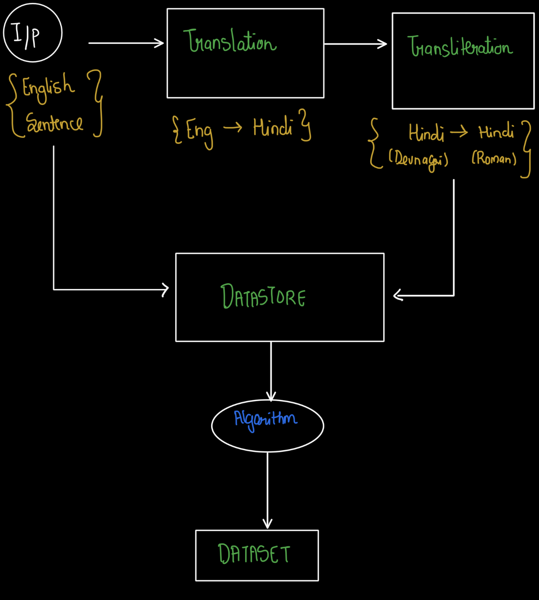

# Synthetic-Multilingual-Code-Switch-Data-Generation-A-Pipeline-for-Low-Resource-Languages

## Research project still going on
 
### Generation_1
This is a systematic approach to generate contextually accurate code-switched sentences (English-Hindi) using machine translation, transliteration, and linguistic rules. The goal is to create natural-sounding sentences where words from Hindi (embedded language) are mixed into an English (matrix language) framework, adhering to syntactic and semantic constraints.


**METHODOLOGY**

1. *Translation*:
   
   We have used `googletrans`
   
   ```
   def translate_to_hindi(input_sentence):
      translated = translator.translate(input_sentence, src='en', dest='hi')
      return translated.text
   ```
3. *Transliteration*:
   
   Used `indic-transliteration` --->  e.g., "बाजार" → "bazaar"

   ```
   def transliterate_to_english(hindi_sentence):
    return transliterate(hindi_sentence, sanscript.DEVANAGARI, sanscript.ITRANS)
   ```
4. *POS Tagging & Syntactic Analysis*:
   
   Used `spaCy--en_core_web_sm`
   ```
   def pos_tagging(input_sentence):
    doc = nlp(input_sentence)
    return [(token.text, token.pos_) for token in doc]
   ```
   Here main rules were:
   - `NOUN`, `ADJ` and `PROPN` are prioritized for switching.
   - `VERB`, `ADP`(pprepositions), `DET`(determiners) are retained in english for the sake of preserving syntatic structure.

5. *Contextual Code-Switching*:
   
   - POS-Based Switching: Replace nouns/adjectives with Hindi transliterations if they meet a probabilistic threshold (e.g., 30–50% chance).
   - Bilingual Word Alignment (BWA): Use a predefined dictionary (`bwa`) to map English words to Hindi transliterations (e.g., `market` → `bazaar`).
   - Randomization: Introduce variability using `random.random()` to avoid deterministic patterns.
   ```
   if (tag in ['NOUN', 'ADJ'] and random.random() > 0.3):
    mixed_sentence.append(transliterated_word)
   ```

   
 ### Output for Generation_1
 
  *Input Sentence* : I love eating spicy food during winter. She is reading a book in the park while the kids are playing in the garden with their friends. He went to school to learn mathematics, and my father is working on a big project in his office. They are watching a movie at home tonight. Meanwhile, the dog is barking loudly near the house. We are going to the beach to enjoy the sunset. Later, she wants to bake a chocolate cake for her friend. Tomorrow, I am going to the market to buy some fruits.

 *Output Sentence* : I pasand khana spicy khana during sardi . She is padh rahi a kitaab in the park while the kids are khel rahe in the bagiche with their friends . He went to school to learn mathematics , and my father is working on a big project in his office . They are dekh rahe a movie at home tonight . Meanwhile , the kutta is bhauk raha loudly near the house . We are ja rahe to the beach to maza lene the sunset . Later , she wants to bake a chocolate cake for her dost . Tomorrow , I am ja rahe to the market to buy some phal .

### End-Notes on Generation_1

As you can observe here, that the probablistic model is working in a way, but the problem is there is not context, for that we need some sort of intelligence in the mode, though this approach might work if we can hardcode rules, but for that we need to hardcode lakhs of code and they  might conflict with each other, and in this we need to have a dictionary. So this approach is a deadend as the probablistic model might not be the best possible approach for this contextual switching.


    
